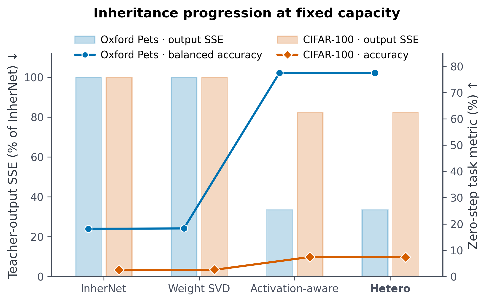
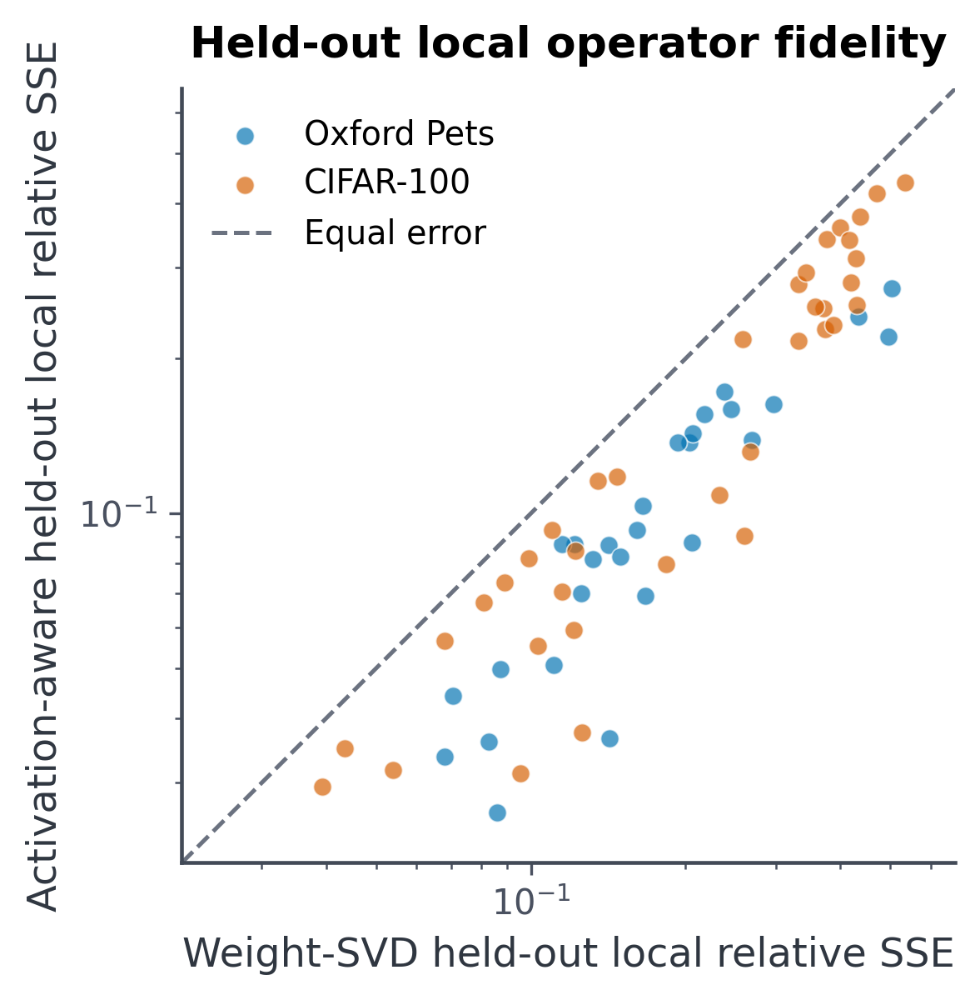
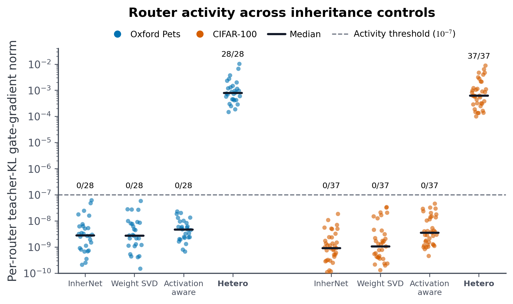
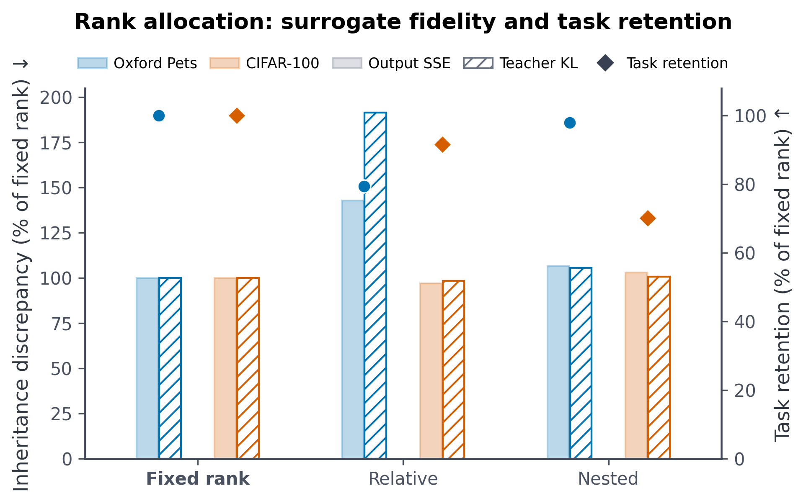

# Hetero: Activation-Aware Conditional-Expert Neural Network Inheritance

Hetero turns fixed-capacity neural-network inheritance into a
**preserve-then-adapt** initialization. At the exact InherNet rank and parameter
count, it minimizes activation-weighted local reconstruction error for the
inherited expert mean, then introduces zero-sum expert deviations that preserve
this reconstruction while exposing conditional router directions.

## 1. Motivation and Contributions

Weight-space SVD preserves dominant parameters, but not necessarily behavior on
task-relevant activations. Moreover, identical inherited experts make the
router locally insensitive at initialization. Hetero addresses both limitations
through one constrained construction:

1. the expert-mean operator is selected under the empirical activation metric;
2. expert deviations are introduced in its zero-sum subspace, preserving the
   inherited mean while making conditional routing locally trainable.

This construction provides exact capacity matching, a closed-form local optimum
under the empirical activation metric, and reconstruction-preserving conditional
directions. Unlike activation-aware decomposition or symmetry-preserving model
transformation in isolation, Hetero studies their joint role in inheriting a
trained conditional-expert network at the exact InherNet capacity.

[SVD-LLM (ICLR 2025)](https://proceedings.iclr.cc/paper_files/paper/2025/hash/3104e1ab39875cf54fe1eb4473e7c5a1-Abstract-Conference.html)
and [CorDA (NeurIPS 2024)](https://proceedings.neurips.cc/paper_files/paper/2024/hash/83f95bb0ac5046338ea2afe3390e9f4b-Abstract-Conference.html)
establish activation-oriented decomposition, while
[LEMON (ICLR 2024)](https://proceedings.iclr.cc/paper_files/paper/2024/hash/0e705ac30e573d1526f81a0fd071a151-Abstract-Conference.html)
provides a precedent for symmetry-preserving transformation. Hetero's
contribution is the inheritance-specific preserve-then-adapt constraint that
connects these principles at fixed conditional-expert capacity.

## 2. InherNet Baseline and Trained Sources

For a trained source weight

$$
W\in\mathbb{R}^{m\times n},\qquad W=U\Sigma V^\top,
$$

the rank-$r$ InherNet initialization uses balanced factors

$$
W^{\mathrm{down}}=\Sigma_r^{1/2}V_r^\top,\qquad
W_h^{\mathrm{up}}=U_r\Sigma_r^{1/2}.
$$

The gate is a softmax over experts. Because its weights sum to one, identical
up-projection experts reconstruct $U_r\Sigma_rV_r^\top$ at initialization.
All methods inherit from the same task-trained dense checkpoint. The source
remains frozen when used for distillation, ensuring that differences arise from
the inherited parameterization and training objective rather than teacher
drift.

## 3. Hetero

### 3.1 Uncentered Activation Second Moments

For layer input feature $x$, Hetero estimates

$$
\widehat M=\frac{1}{N}\sum_{i=1}^{N}x_ix_i^\top.
$$

The uncentered second moment follows directly from the local reconstruction
objective

$$
\mathbb{E}\| (W-\widehat W)x\|_2^2
=\operatorname{tr}\!\left((W-\widehat W)M
(W-\widehat W)^\top\right).
$$

The empirical estimate is stabilized as

$$
\mu=\frac{\operatorname{tr}(\widehat M)}{d},\qquad
M_\lambda=(1-\lambda)\widehat M
+\lambda\mu I+\epsilon\mu I,
$$

with an analogous element-wise form for diagonal moments. The reference
configuration uses shrinkage $\lambda=0.01$, 16 calibration batches, and at
most 4096 sampled features per layer per batch. Matrix-valued modes add
positive diagonal jitter before Cholesky factorization. We denote the
stabilized matrix actually factored by $\widetilde M_\lambda$.

Calibration scales with layer shape:

- convolution patch dimension at most 256: exact unfolded patch moments;
- wider convolutions: a stride-, dilation-, padding-, and
  kernel-position-aware channel-block approximation;
- linear input dimension at most 512: a full second moment;
- wider linear layers: a diagonal second moment; and
- transformer inputs: padding tokens are excluded using the attention mask.

The full-moment construction instantiates the theorem in Section 4 exactly.
Channel-block and diagonal statistics define memory-bounded surrogate metrics.

### 3.2 Data-Weighted Preserve-Then-Adapt Decomposition

Let

$$
\widetilde M_\lambda=CC^\top,\qquad A=WC.
$$

If $[A]_r=U_r\Sigma_rV_r^\top$, Hetero initializes

$$
W^{\mathrm{down}}
=\Sigma_r^{1/2}V_r^\top C^{-1},\qquad
W_h^{\mathrm{up}}
=U_r\Sigma_r^{1/2}+E_h,\qquad
\sum_{h=1}^{H}E_h=0.
$$

The first constraint preserves the source where calibration activations place
mass. The second breaks expert symmetry without changing the average
reconstruction. A zero-initialized softmax router consumes the compressed
feature, so the two constraints form one preserve-then-adapt initialization
rather than a collection of independent modules.

### 3.3 Registered-Rank Capacity Matching

Hetero uses the same registered layer rank, eligible layers, expert count,
router dimensions, biases, and dense-layer decisions as its matched InherNet.
Hetero-Lite matches InherNet-Small, while Hetero matches InherNet-Large.
Consequently, each comparison has exact total-model parameter equality by
construction, including fixed vision parameters and fixed BERT embeddings.

The CIFAR-100 pairs use the ranks printed in the InherNet paper. Measured
construction counts are reported for the two pairs whose printed ranks and
reported counts disagree. Hetero fixes these registered ranks by design. The
pre-study evaluates heterogeneous allocation under the same parameter cap only as a
diagnostic of whether additional allocation complexity improves behavioral
preservation.

### 3.4 Routing and Training Objective

For mean routing probabilities $\bar g_h$, define

$$
\mathcal L_{\mathrm{bal}}
=H\sum_{h=1}^{H}\bar g_h^2-1\ge 0.
$$

The current reference fine-tuning objective uses
$\lambda_{\mathrm{bal}}=0.01$:

$$
\mathcal L
=w_{\mathrm{CE}}\mathcal L_{\mathrm{CE}}
+w_{\mathrm{KD}}T^2
\operatorname{KL}(p_{\mathrm{teacher}}^T\|p_{\mathrm{student}}^T)
+\lambda_{\mathrm{bal}}\mathcal L_{\mathrm{bal}}.
$$

For supervised configurations, the task term replaces the CE--KD mixture.
HPO compares $\lambda_{\mathrm{bal}}\in\{0,0.01,0.03\}$, and the zero-weight
component ablation isolates its contribution. All inherited factors and routers
are optimized end to end.

## 4. Theoretical Analysis

### 4.1 Data-Weighted Eckart--Young Theorem

Let $M\succ0$, $M=CC^\top$, and $A=WC$. Among all matrices $Q$ with rank at
most $r$,

$$
Q_r^*=[A]_rC^{-1}
$$

minimizes

$$
\operatorname{tr}\!\left((W-Q)M(W-Q)^\top\right)
=\|(W-Q)C\|_F^2.
$$

The proof changes variables to $B=QC$ and applies the ordinary
Eckart--Young--Mirsky theorem. The result is exact for the stabilized empirical
full-moment metric.

### 4.2 Initialization Preservation and Conditional Tangent

With a zero-initialized softmax gate, $g_h=1/H$. Since $\sum_hE_h=0$,

$$
\frac{1}{H}\sum_h
(U_r\Sigma_r^{1/2}+E_h)
\Sigma_r^{1/2}V_r^\top C^{-1}
=[A]_rC^{-1}.
$$

Thus expert deviations preserve the rank-$r$ data-weighted reconstruction at
initialization. Let $a_j$ be router logit $j$, let
$z=W^{\mathrm{down}}x$, and write expert $h$ as $B+E_h$. Then

$$
\frac{\partial y}{\partial a_j}
=g_j\left((B+E_j)z+b-y\right)
=\frac{1}{H}E_jz.
$$

Identical experts give a zero router derivative at the zero-logit
initialization; the zero-sum lift generically exposes a first-order conditional
learning signal while preserving the inherited map.

### 4.3 From Local Guarantee to Empirical Evaluation

The theorem identifies the layer-local behavior guaranteed by the construction.
It is exact for the stabilized full moment, while channel-block and diagonal
statistics provide scalable surrogate metrics. Sections 6 and 7 connect these
initialization properties to downstream accuracy and learned specialization
through controlled empirical evaluation.

## 5. Dataset and Model Protocols

| Dataset family | Teacher $\rightarrow$ student | Initialization | Inherited source/objective | Targets |
|---|---|---|---|---|
| CIFAR-10 | ResNet-50 $\rightarrow$ ResNet-18 with CIFAR stem | random | trained teacher / KD | convolution |
| CIFAR-100 | eight CIFAR-native ResNet, VGG, and WRN pairs | random | trained teacher / supervised | convolution |
| Oxford-IIIT Pet | ResNet-34 $\rightarrow$ ResNet-18 | ImageNet pretrained, new 37-class head | fine-tuned teacher / KD | convolution |
| GLUE | BERT-Mini $\rightarrow$ BERT-Tiny | pretrained compact BERT | fine-tuned teacher / KD | linear |

| Dataset family | Optimizer | Batch | Epochs | Learning rate | Weight decay | Schedule |
|---|---|---:|---:|---:|---:|---|
| CIFAR-10 | SGD, momentum 0.9 | 128 | 200 | 0.05 | $5\times10^{-4}$ | decay at 100, 150, 180 |
| CIFAR-100 | SGD, momentum 0.9 | 64 | 240 | 0.05 | $5\times10^{-4}$ | decay at 150, 180, 210 |
| Oxford-IIIT Pet | SGD, momentum 0.9 | 32 | 30 | 0.001 | $10^{-4}$ | decay at 15, 25 |
| GLUE compact BERT | AdamW | 32 | 4 | $5\times10^{-5}$ | 0.01* | 10% linear warmup, linear decay |

`*` Bias and LayerNorm parameters are excluded from weight decay, and the
global gradient norm is clipped at 1.0.

The benchmark suite spans scratch-trained vision on CIFAR,
ImageNet-initialized fine-grained transfer on Oxford Pets, and compact
transformer transfer on GLUE. Convolutions are inherited for vision, while
attention and feed-forward projections are inherited for GLUE. The small
Oxford classifier, transformer embeddings, and normalization layers remain
dense. The compact-BERT GLUE track is a resource-efficient cross-modal
extension that complements the original T5 benchmark.

The CIFAR-100 pairs are ResNet-32/8, ResNet-32x4/8x4, VGG-13/8,
WRN-40-2/40-1, WRN-40-2/16-2, ResNet-56/20, ResNet-110/32, and
ResNet-110/20. GLUE covers MRPC, QQP, SST-2, MNLI, RTE, QNLI, CoLA, and
STS-B. MRPC and QQP report accuracy and F1; SST-2, MNLI, RTE, and QNLI report
accuracy; CoLA reports Matthews correlation; and STS-B reports Pearson and
Spearman correlations.

## 6. Experiment and Search Protocol

Each teacher is trained for the complete dataset schedule, selected using its
validation metric, and reused unchanged by student KD, InherNet, Hetero,
ablations, and HPO. CIFAR search uses a fixed stratified 10% training holdout,
Oxford uses its fixed stratified validation split, and GLUE search reserves the
official validation split for formal reporting. Official test data are used
only after model selection.

Every HPO candidate uses the same epoch count as formal training. Mechanism and
learning-rate screening cover CIFAR-10, CIFAR-100 ResNet-56-to-ResNet-20,
Oxford Pets, SST-2, and STS-B. HPO tunes Hetero at the InherNet-Large capacity;
InherNet retains its registered settings, and Hetero-Lite inherits the selected
Hetero recipe as a capacity ablation.

The mechanism screen varies routing regularization, moment shrinkage, and
zero-sum lift scale; learning rate and distillation settings are screened
separately to avoid confounding optimizer and mechanism effects. Selection uses
seeds 42, 123, and 2026, confirmation uses seed 3407, and final estimates use
disjoint seeds 7, 17, 27, and 37.

For reproducibility, mechanism candidates fix the learning-rate multiplier at
1.0, and mechanism and learning-rate candidates use the objective registered
for each dataset profile. Distillation candidates likewise fix the multiplier
at 1.0. These references are read from the committed confirmation registry,
not from recipes selected after HPO; each generated command contains every
controlled argument exactly once.

The comparison includes the teacher, compact student, student KD, and
capacity-matched InherNet under both its registered supervised objective and
the selected Hetero objective. A supervised Hetero control accompanies every
distilled headline recipe. Component ablations isolate activation weighting,
the zero-sum conditional lift, learned versus fixed-uniform routing, routing
regularization, and calibration budget. Hetero-Lite tests the
accuracy--efficiency trade-off.

## 7. Problem-Driven Pre-Study

The pre-study asks whether the two constraints achieve their two design
objectives before any optimizer step:

1. activation weighting should improve teacher-behavior preservation at the
   same rank and parameter count; and
2. the zero-sum lift should activate router gradients without materially
   changing the inherited predictions.

Oxford Pets provides a small, fine-grained transfer setting, while CIFAR-100
ResNet-56-to-ResNet-20 tests whether the effect transfers to scratch-trained
vision. Fidelity and task metrics use the complete validation split. To test
the decomposition claim without confounding it with upstream approximation
errors, a held-out local-operator probe feeds dense-teacher activations into
each matching inherited operator for four deterministic validation batches and
reports the ratio of summed output errors to summed dense-output energy.
Construction also records each layer's relative expert-mean shift, directly
checking the zero-mean lift invariant. Router gradients are measured on the
first deterministic evaluation minibatch—32
Oxford examples or 64 CIFAR-100 examples—using teacher KL without an optimizer
step. Each router dot reports
$\max(\|\partial\mathrm{KL}/\partial W_{\mathrm{gate}}\|_2,
\|\partial\mathrm{KL}/\partial b_{\mathrm{gate}}\|_2)$ for one inherited
layer.

### 7.1 Activation Geometry Preserves Task-Relevant Behavior

At fixed capacity, activation weighting reduces teacher-output relative SSE by
66.52% on Oxford and 17.59% on CIFAR-100. Teacher KL falls by 82.44% and 14.10%,
respectively; agreement rises by 61.41 and 5.28 percentage points. These
behavioral improvements coincide with gains of 59.175 points in Oxford
balanced accuracy and 4.88 points in CIFAR-100 accuracy. Output cosine
similarity rises by 0.419 and 0.282.

### 7.2 Activation Weighting Improves Every Probed Local Operator

The held-out local probe isolates each factorized layer by replaying the same
dense-teacher inputs through its dense and inherited operators. Activation
weighting reduces aggregate local relative SSE from 0.1255 to 0.0598 on Oxford
(52.3%) and from 0.2869 to 0.1849 on CIFAR-100 (35.6%). The improvement holds
for all 65 probed operators across both architectures. This layerwise result
connects the activation geometry used during decomposition to the end-to-end
behavioral gains above.

### 7.3 The Conditional Lift Exposes Router Tangents

The zero-sum lift changes relative SSE by only $5.89\times10^{-5}$ on Oxford
and $1.90\times10^{-6}$ on CIFAR-100, while leaving task performance and
teacher agreement unchanged. Normalized routing entropy remains exactly 1.0,
while mean relative expert diversity rises from numerical zero to 0.008173 on
Oxford and 0.008152 on CIFAR-100: the lift creates distinct experts without
disturbing uniform mean routing. It raises router-gradient RMS from
$1.54\times10^{-9}$ to $2.27\times10^{-4}$ on Oxford and from
$3.20\times10^{-9}$ to $3.63\times10^{-4}$ on CIFAR-100—approximately
$1.47\times10^5$-fold and $1.13\times10^5$-fold gains. All 28 Oxford and all
37 CIFAR-100 router layers cross the $10^{-7}$ activity tolerance after the
lift, whereas none cross it with identical experts.

### 7.4 Fixed Rank Avoids a Surrogate--Task Mismatch

The allocation diagnostic explains why rank reallocation is excluded from the
method. On CIFAR-100, relative allocation lowers relative SSE from 0.8369 to
0.8108 but also lowers zero-step accuracy from 7.42% to 6.80%. On Oxford, both
relative and nested allocation underperform the fixed-rank activation-aware
construction in reconstruction and balanced accuracy. Optimizing a layerwise
allocation surrogate therefore adds complexity without reliably improving
teacher behavior or the downstream task metric.

### 7.5 Completed Zero-Step Diagnostics

| Dataset | Construction | Parameters | Rank range | Relative SSE | Teacher KL / agreement | Initial metric | Router-grad RMS |
|---|---|---:|---:|---:|---:|---:|---:|
| Oxford | weight-only | 5,699,257 | 64 | 0.847742 | 2.766147 / 19.57% | 18.293 BAcc | $1.63\times10^{-9}$ |
| Oxford | activation-aware base | 5,699,257 | 64 | 0.283789 | 0.485746 / 80.98% | 77.468 BAcc | $1.54\times10^{-9}$ |
| Oxford | Hetero conditional lift | 5,699,257 | 64 | 0.283848 | 0.485838 / 80.98% | 77.468 BAcc | $2.27\times10^{-4}$ |
| CIFAR-100 | weight-only | 383,507 | 16 | 1.015533 | 4.350336 / 2.54% | 2.54 Acc | $2.36\times10^{-9}$ |
| CIFAR-100 | activation-aware base | 383,507 | 16 | 0.836891 | 3.736992 / 7.82% | 7.42 Acc | $3.20\times10^{-9}$ |
| CIFAR-100 | Hetero conditional lift | 383,507 | 16 | 0.836893 | 3.736822 / 7.82% | 7.42 Acc | $3.63\times10^{-4}$ |

This seed-42 initialization study establishes the predicted preservation and
conditional-tangent effects; full-epoch, multi-seed experiments will determine
how they translate into the final accuracy--efficiency frontier.

## 8. Conclusion

Hetero recasts inheritance as a constrained initialization problem: preserve
the teacher where task activations place mass, then expose conditional degrees
of freedom without additional capacity or initial reconstruction error. The
pre-study verifies both predicted initialization effects and motivates a
single, registered-rank preserve-then-adapt mechanism for formal evaluation.
